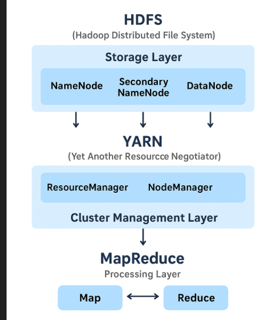
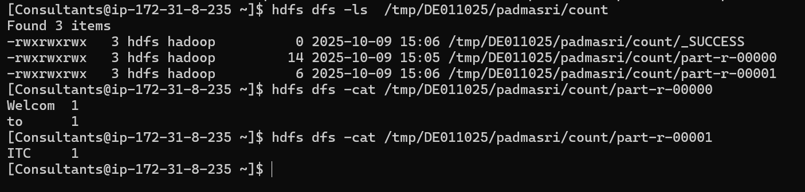

## Hadoop
#### What is hadoop?
Hadoop is an open-source, distributed processing framework used to efficiently store and process large datasets across clusters of computers. It was one of the first Big Data management tools to gain widespread adoption in the industry.
### How big data evolved?
Before Hadoop, traditional databases and systems struggled to handle the 3Vs of Big Data — Volume, Velocity, and Variety.
As data grew exponentially (from logs, sensors, IoT, and social media), organizations needed a scalable and fault-tolerant system — this led to the creation of Hadoop by Doug Cutting and Mike Cafarella, inspired by Google’s MapReduce and GFS (Google File System) papers.
### Hadoop Architecture?
Hadoop is based on a Master-Slave architecture and consists of three main components:
HDFS (Hadoop Distributed File System) — Storage Layer
YARN (Yet Another Resource Negotiator) — Cluster Management Layer
MapReduce — Processing Layer

#### Architecture
![img]

#### MapReduce – Processing Layer
##### Purpose:
To process large-scale data in parallel across the cluster.
How it Works:
Map Phase:
Splits the input data into chunks and processes them in parallel, generating intermediate key-value pairs.
Reduce Phase:
Aggregates or summarizes the intermediate data to produce the final output.
##### Analogy:
MapReduce is the data processor that works on top of HDFS using the cluster resources managed by YARN.

#### YARN - Cluster Management Layer
##### Purpose:
YARN manages and schedules cluster resources (CPU, memory) for processing tasks.
##### Main Components:
ResourceManager (Master): Allocates cluster resources to different applications.
NodeManager (Slave): Runs on each node, monitors resource usage, and reports to the ResourceManager.
ApplicationMaster: Manages the execution of a specific job (e.g., a MapReduce job).
##### Analogy:
YARN acts like the operating system for your Hadoop cluster — deciding how much CPU and memory each application gets.

#### HDFS - – Processing Layer
##### Purpose:
To store large data files across multiple machines in a reliable and fault-tolerant way.
##### Main Components:
###### NameNode (Master Node):
Stores metadata about files, such as file names, block locations, permissions, and replication details.
Metadata is stored in RAM for fast access and persisted to disk as fsimage and edit logs.
Does not store actual data — only metadata.
###### Secondary NameNode (Checkpoint Node):
Not a backup of the NameNode.
Periodically merges the NameNode’s fsimage and edit logs to create a new checkpoint.
Prevents the logs from growing too large and helps the NameNode restart faster after a crash.
###### DataNode (Slave Node):
Stores actual data blocks.
Sends heartbeat and block reports to the NameNode every 10 seconds to confirm it’s active.
When clients read/write data, they communicate directly with DataNodes, not through the NameNode.
###### Block Storage:
Large files are divided into fixed-size blocks (default size: 128 MB).
Each block is stored on different DataNodes for parallel access and reliability.
###### Data Replication:
Each block is replicated to ensure fault tolerance.
Default replication factor: 3
One replica on the local rack
Second replica on a different rack (for rack fault tolerance)
Third replica on the same remote rack
If one DataNode fails, the data can still be accessed from the replicas on other nodes.
###### Formatting HDFS:
Formatting is done once before starting the cluster.
During startup, the NameNode loads the metadata from the defined directory, which includes:
fsimage_0000 (filesystem snapshot)
txid (transaction ID)
version (contains NSID, BpoolID, and clusterID)

Example: Count the words of a file in HDFS
1. Connect to the server using SSH:
Username: ssh Consultants@18.134.163.221
Password: WelcomeItc@2022
2. Create a text file --> vi data.txt(Add some content) 
3. Create Python files for a custom MapReduce job:
vi mapper.py     # Add your Python mapper code
vi reducer.py    # Add your Python reducer code
4. Upload the file from local to HDFS:
hdfs dfs -put data.txt /tmp/DE011025/padmasri/ 
5. Run the Hadoop WordCount example JAR:
sudo -u hdfs hadoop jar /opt/cloudera/parcels/CDH/lib/hadoop-mapreduce/hadoop-mapreduce-examples.jar wordcount /tmp/DE011025/padmasri/data.txt /tmp/DE011025/padmasri/count
6. Verify that the output directory has been created:
hdfs dfs -ls /tmp/DE011025/padmasri
Example output:
drwxrwxrwx   - hdfs        hadoop          0 2025-10-09 15:06 /tmp/DE011025/padmasri/count
7. View the WordCount results:
hdfs dfs -ls /tmp/DE011025/padmasri/count
hdfs dfs -cat /tmp/DE011025/padmasri/count/part-r-00000
hdfs dfs -cat /tmp/DE011025/padmasri/count/part-r-00001
8. Example output:
Welcom  1
to      1
ITC     1
output screenshot:
![img]

