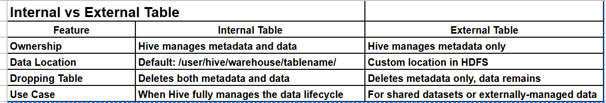
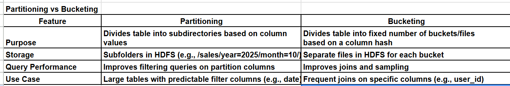

# Hive

Hive is a data warehouse infrastructure built on top of Hadoop for **querying and managing large datasets**. It provides a SQL-like interface called **HiveQL** for querying data stored in HDFS, making it easier for analysts and developers familiar with SQL to work with Hadoop.
## Why Hive?
- Converts SQL queries into MapReduce, Tez, or Spark jobs.  
- Provides **schema on read**.  
- Handles large-scale structured and semi-structured data.  
- Supports analytics, summarization, and reporting.

## Internal (Managed) vs External Table
### 1. Internal Table
- Hive owns both the **table metadata** and **data**.  
- Dropping the table deletes **both metadata and data** from HDFS.  
- Default location: `/user/hive/warehouse/tablename/`  
- Use when Hive fully manages the data lifecycle.

### Example: Creating and Dropping a Hive Table
```sql 
CREATE TABLE employees (
    id INT,
    name STRING,
    department STRING
)
ROW FORMAT DELIMITED
FIELDS TERMINATED BY ','
STORED AS TEXTFILE;

-- Load data
LOAD DATA INPATH '/user/hive/input/employees.txt' INTO TABLE employees;

-- Dropping Internal Table
DROP TABLE employees;
-- Deletes both metadata and data from HDFS 
```
### 2. External Table
- Hive manages only table metadata; data remains in HDFS.
- Dropping the table deletes metadata only.
- Use for shared datasets or external-managed data.

### Example: Creating and Dropping a External Hive Table
```sql 
CREATE EXTERNAL TABLE emp_ext (
    id INT,
    name STRING,
    department STRING
)
ROW FORMAT DELIMITED
FIELDS TERMINATED BY ','
STORED AS TEXTFILE
LOCATION '/user/hive/external/employees/';

DROP TABLE emp_ext;
-- Deletes schema but data remains in HDFS
```
## Partitioning
Purpose: Improves query performance by dividing a table into subdirectories based on column values.
### Example: 
```sql 
CREATE TABLE sales (
    id INT,
    product STRING,
    amount FLOAT
)
PARTITIONED BY (year INT, month INT)
STORED AS TEXTFILE;

LOAD DATA INPATH '/user/hive/input/sales_2025_10.txt' 
INTO TABLE sales
PARTITION (year=2025, month=10);

SELECT * FROM sales WHERE year=2025 AND month=10;
-- Notes: Partitions are stored as subfolders: /sales/year=2025/month=10/.
```
## Bucketing
Purpose: Divides data into fixed number of buckets based on a column hash (e.g., user_id).
Improves join performance and sampling.
### Example: 
```sql 
CREATE TABLE employees_bucketed (
    id INT,
    name STRING,
    department STRING
)
CLUSTERED BY (id) INTO 4 BUCKETS
STORED AS ORC;

INSERT INTO TABLE employees_bucketed
SELECT * FROM employees;

SELECT * FROM employees_bucketed TABLESAMPLE(BUCKET 2 OUT OF 4);
-- Notes: Buckets are physically stored as files in HDFS.
```



